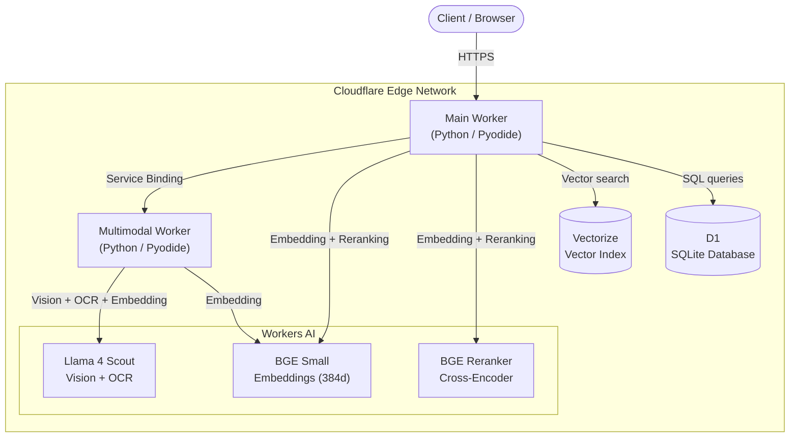
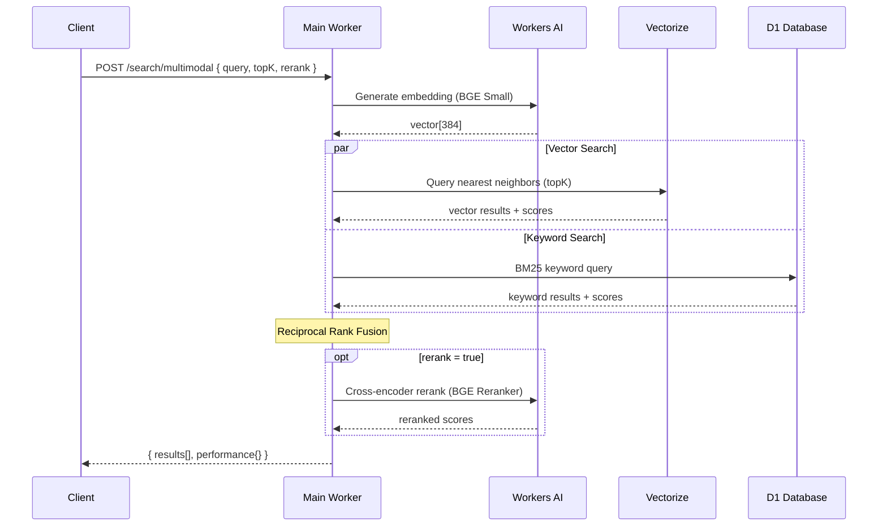
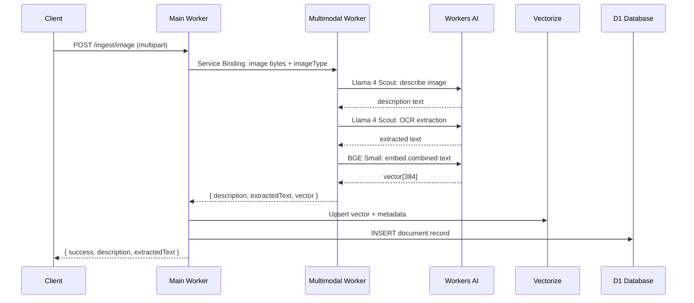
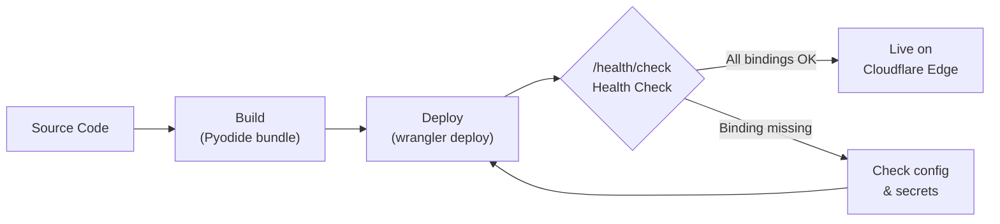

# Production Deployment Guide

This document covers deploying and operating the Vectorize MCP Worker (Python) in production on Cloudflare's global edge network.

## Table of Contents

1. [Infrastructure Overview](#infrastructure-overview)
2. [Prerequisites](#prerequisites)
3. [Infrastructure Setup](#infrastructure-setup)
4. [Configuration](#configuration)
5. [Deployment](#deployment)
6. [Post-Deployment Verification](#post-deployment-verification)
7. [Security](#security)
8. [Monitoring & Observability](#monitoring--observability)
9. [API Reference](#api-reference)
10. [Operations](#operations)
11. [Scaling & Limits](#scaling--limits)
12. [Troubleshooting](#troubleshooting)

---

## Infrastructure Overview

### Architecture



### Search Request Flow



### Image Ingestion Flow



### Deployment Flow



## Prerequisites

| Requirement | Purpose |
|-------------|---------|
| Cloudflare account (Workers Paid plan) | Workers Paid is required for Vectorize and D1 production usage |
| [wrangler](https://developers.cloudflare.com/workers/wrangler/) >= 3.x | CLI for managing Cloudflare resources |
| [uv](https://docs.astral.sh/uv/) | Python package manager |
| `workers-py` (via `uv tool install workers-py`) | Python Workers build toolchain |

Verify your setup:

```bash
wrangler --version        # >= 3.0
uv --version              # any recent version
wrangler whoami           # confirms you're authenticated
```

## Infrastructure Setup

The worker depends on four Cloudflare services:

| Service | Binding Name | Purpose |
|---------|-------------|---------|
| **Workers AI** | `AI` | Embedding (`bge-small-en-v1.5`), reranking (`bge-reranker-base`), vision (`llama-4-scout`) |
| **Vectorize** | `VECTORIZE` | 384-dimension cosine vector index for semantic search |
| **D1** | `DB` | SQLite database for documents, BM25 keywords, licenses, settings |
| **Service Binding** | `MULTIMODAL` | Internal binding to a multimodal image processing worker |

### 1. Create the Vectorize Index

```bash
wrangler vectorize create mcp-knowledge-base \
  --dimensions=384 \
  --metric=cosine
```

### 2. Create the D1 Database

```bash
wrangler d1 create mcp-knowledge-db
```

Copy the `database_id` from the output.

### 3. Apply the Database Schema

```bash
wrangler d1 execute mcp-knowledge-db --remote --file=./schema.sql
```

This creates six tables: `documents`, `keywords`, `doc_stats`, `term_stats`, `licenses`, and `settings`. See `schema.sql` for the full DDL.

## Configuration

### wrangler.toml

Copy the example and fill in your values:

```bash
cp wrangler.toml.example wrangler.toml
```

Edit `wrangler.toml` and replace the D1 database ID:

```toml
[[d1_databases]]
binding = "DB"
database_name = "mcp-knowledge-db"
database_id = "your-actual-database-id"
```

### Secrets

The worker uses three secrets/variables. Set them via `wrangler secret put`:

| Secret | Required | Purpose |
|--------|:--------:|---------|
| `API_KEY` | **Yes** | Bearer token for all authenticated endpoints |
| `INTERNAL_SECRET` | No | Shared secret between main worker and multimodal worker (sent as `X-Internal-Secret` header on service-binding calls) |
| `DEBUG_LOGGING` | No | Set to `"true"` to enable verbose debug logs (visible via `wrangler tail`) |

```bash
wrangler secret put API_KEY
wrangler secret put INTERNAL_SECRET   # only if using multimodal worker
```

Enter a strong, random value when prompted. These secrets are:
- Stored encrypted in Cloudflare's infrastructure
- Never exposed in `wrangler.toml` or logs
- `API_KEY` is required as a `Bearer` token for all non-public endpoints

Generate a strong key:

```bash
openssl rand -hex 32
```

> **Tip:** `DEBUG_LOGGING` can also be set as a plain-text variable in `wrangler.toml` under `[vars]` instead of as a secret, since it contains no sensitive data.

### Environment-Specific Overrides

For staging vs production, use wrangler environments:

```toml
# wrangler.toml

[env.staging]
name = "vectorize-mcp-worker-python-staging"

[[env.staging.d1_databases]]
binding = "DB"
database_name = "mcp-knowledge-db-staging"
database_id = "your-staging-db-id"

[[env.staging.vectorize]]
binding = "VECTORIZE"
index_name = "mcp-knowledge-base-staging"
```

Deploy to a specific environment:

```bash
uv run pywrangler deploy --env staging
```

## Deployment

### Deploy the Main Worker

```bash
uv run pywrangler deploy
```

This compiles the Python source via Pyodide, bundles it, and pushes it to Cloudflare's edge network. The worker is available globally within seconds.

> If the `[[services]]` block for `MULTIMODAL` is present in `wrangler.toml` and the multimodal worker hasn't been deployed yet, this will fail. Either deploy the multimodal worker first (see below) or comment out the binding until you need image features.

### Deploy the Multimodal Worker (optional -- for image features)

The `MULTIMODAL` service binding points to a separate worker (`multimodal-pro-worker/`) that handles image description, OCR, and embedding via Llama 4 Scout + BGE. It lives inside this repository.

```bash
cd multimodal-pro-worker
uv tool install workers-py    # if not already installed
uv run pywrangler deploy
cd ..
```

After deploying the multimodal worker, **redeploy the main worker** so Cloudflare can resolve the service binding:

```bash
uv run pywrangler deploy
```

If you don't need image features, comment out the `[[services]]` block in `wrangler.toml`:

```toml
# [[services]]
# binding = "MULTIMODAL"
# service = "multimodal-pro-worker"
```

Text features work normally without it; image endpoints (`/ingest/image`, `/search/similar-images`) return HTTP 501.

### Custom Domain

By default, the worker is accessible at `vectorize-mcp-worker-python.<your-subdomain>.workers.dev`. To use a custom domain:

1. Go to **Cloudflare Dashboard > Workers & Pages > your worker > Settings > Domains & Routes**
2. Add a custom domain (must be on a zone in your Cloudflare account)
3. Or add a route pattern like `api.yourdomain.com/v1/*`

### CI/CD Deployment

For automated deployments, use a `CLOUDFLARE_API_TOKEN` with the **Edit Cloudflare Workers** permission template:

```bash
# In your CI pipeline
export CLOUDFLARE_API_TOKEN="your-ci-token"
export CLOUDFLARE_ACCOUNT_ID="your-account-id"

# Deploy multimodal worker first (if using image features)
cd multimodal-pro-worker && uv run pywrangler deploy && cd ..

# Deploy main worker (must come after multimodal if service binding is enabled)
uv run pywrangler deploy
```

## Post-Deployment Verification

Run these checks after every production deployment:

### 1. Health Check

```bash
curl https://your-worker-url/health/check
```

Expected response:

```json
{
  "status": "healthy",
  "bindings": {
    "hasAI": true,
    "hasVectorize": true,
    "hasD1": true,
    "hasAPIKey": true
  },
  "mode": "production"
}
```

**Critical**: `mode` must be `"production"` (meaning `API_KEY` is set). If it shows `"development"`, your secret is missing and all endpoints are unprotected.

### 2. API Root

```bash
curl https://your-worker-url/
```

Verify the JSON response lists all endpoints and shows `"authentication": "required"`.

### 3. Stats Endpoint

```bash
curl -H "Authorization: Bearer YOUR_API_KEY" https://your-worker-url/stats/index
```

### 4. Search Test

```bash
curl -X POST https://your-worker-url/search/multimodal \
  -H "Content-Type: application/json" \
  -H "Authorization: Bearer YOUR_API_KEY" \
  -d '{"query": "test", "topK": 1}'
```

Or documents only:

```bash
curl -X POST https://your-worker-url/search/documents \
  -H "Content-Type: application/json" \
  -H "Authorization: Bearer YOUR_API_KEY" \
  -d '{"query": "test", "topK": 1}'
```

### 5. Dashboard

Open `https://your-worker-url/dashboard` in a browser. The interactive playground should load.

## Security

### Authentication Model

**Public routes** (no authentication):

| Route | Description |
|-------|-------------|
| `GET /` | API documentation (read-only) |
| `GET /health/check` | Health check and binding status |
| `GET /dashboard` | Interactive playground UI |
| `GET /llms.txt` | AI search engine info |

**Authenticated routes** (Bearer token required):

| Route | Description |
|-------|-------------|
| `POST /search/multimodal` | Hybrid search -- docs + images |
| `POST /search/documents` | Hybrid search -- documents only |
| `POST /search/similar-images` | Visual similarity search (image input) |
| `POST /ingest/document` | Ingest document with auto-chunking |
| `POST /ingest/image` | Ingest image with AI description + OCR |
| `GET /stats/index` | Index statistics |
| `GET /get/document/:id` | Get full text document by ID |
| `GET /get/image/:id` | Get full image document by ID |
| `GET /list/documents` | List documents with pagination |
| `DELETE /delete/document/:id` | Delete document by ID |
| `POST /init/reset-passphrase` | Set/rotate the reset passphrase |
| `POST /reset/all` | Wipe all databases (requires passphrase) |
| `POST /reset/documents` | Wipe documents + vectors (requires passphrase) |
| `POST /reset/licenses` | Wipe licenses only (requires passphrase) |
| `POST /license/validate` | Validate a license key |
| `POST /license/create` | Create a license (admin) |
| `GET /license/list` | List all licenses (admin) |
| `POST /license/revoke` | Revoke a license (admin) |
| `DELETE /delete/license/:key` | Delete a license by key |

### Production Security Checklist

- [ ] **API_KEY is set** -- verify `/health/check` returns `"mode": "production"`
- [ ] **Strong API key** -- use at least 32 random hex characters
- [ ] **HTTPS only** -- Cloudflare Workers enforce HTTPS by default on `*.workers.dev`; verify custom domains use Full (Strict) SSL mode
- [ ] **CORS** -- the worker allows `Access-Control-Allow-Origin: *`. If you need to restrict origins, modify `cors_headers()` in `src/auth.py`
- [ ] **No secrets in git** -- `wrangler.toml` is in `.gitignore`; only `wrangler.toml.example` is committed
- [ ] **License system** -- if using the license endpoints, create license keys via `POST /license/create` and distribute them to authorized consumers

### Rotating the API Key

```bash
wrangler secret put API_KEY
# Enter new value
```

The new key takes effect immediately. Existing requests using the old key will receive `403 Forbidden`.

## Monitoring & Observability

### Live Logs with wrangler tail

The primary debugging tool. Stream real-time logs (Python tracebacks, request metadata, console output) from the deployed worker:

```bash
wrangler tail --format=json
```

Keep this running in a terminal while testing or after a deployment. Useful filters:

```bash
wrangler tail --format=json --status error    # only show errors
wrangler tail --format=json --method POST     # only POST requests
wrangler tail --format=json --search "search" # filter by path/content
```

### Built-in Observability

The worker has `[observability] enabled = true` in `wrangler.toml`. This enables:

- **Workers Analytics** in the Cloudflare dashboard (requests, errors, CPU time, duration)
- **Cloudflare Dashboard:** Workers & Pages > your worker > Logs tab for historical request logs

### Key Metrics to Watch

| Metric | Where | Alert Threshold |
|--------|-------|----------------|
| Error rate | Workers Analytics | > 1% of requests |
| P99 latency | Workers Analytics | > 5000ms |
| CPU time per request | Workers Analytics | Approaching 30s limit |
| D1 rows read/written | D1 Analytics | Approaching plan limits |
| Vectorize query count | Vectorize Analytics | Approaching plan limits |
| AI inference | Workers AI Analytics | Unexpected spikes |

### Performance Telemetry

Every `/search/multimodal` and `/search/documents` response includes a `performance` object:

```json
{
  "performance": {
    "embeddingTime": "45ms",
    "vectorSearchTime": "12ms",
    "keywordSearchTime": "8ms",
    "rerankerTime": "120ms",
    "totalTime": "195ms"
  }
}
```

Each search result also includes a `scores` breakdown:

```json
{
  "scores": {
    "vector": 0.85,
    "keyword": 0.72,
    "reranker": 0.91
  }
}
```

Use these to identify bottlenecks. The reranker is typically the slowest step; disable it (`"rerank": false`) if latency is critical and precision can be traded off.

### Search Cache

The `HybridSearchEngine` maintains an in-memory cache with a 60-second TTL. Identical queries within the TTL window return `"totalTime": "0ms (cached)"`. Note that each Worker isolate has its own cache -- this is per-isolate, not global.

## API Reference

All authenticated endpoints require the `Authorization: Bearer YOUR_API_KEY` header. The `AUTH` column below indicates whether the endpoint is public or requires authentication.

### Search

#### `POST /search/multimodal`

Hybrid semantic + keyword search returning both documents and images. Combines vector similarity (BGE Small) with BM25 keyword matching using Reciprocal Rank Fusion (RRF). Optionally reranked by a cross-encoder model.

| Parameter | Type | Default | Description |
|-----------|------|---------|-------------|
| `query` | string | *required* | Search query text |
| `topK` | integer | 5 | Number of results to return (1--20) |
| `rerank` | boolean | true | Use cross-encoder reranking |
| `offset` | integer | 0 | Pagination offset (skip first N results) |
| `snippetLength` | integer | 200 | Maximum snippet length in characters (50--500) |

```bash
curl -X POST https://your-worker-url/search/multimodal \
  -H "Content-Type: application/json" \
  -H "Authorization: Bearer YOUR_API_KEY" \
  -d '{"query": "kubernetes deployment", "topK": 5, "rerank": true}'
```

Response:

```json
{
  "query": "kubernetes deployment",
  "topK": 5,
  "offset": 0,
  "resultsCount": 12,
  "results": [
    {
      "id": "doc-001-chunk-0",
      "score": 0.0476,
      "snippet": "Kubernetes deployments manage ...",
      "category": "docs",
      "isImage": false,
      "title": "Getting Started with K8s",
      "source": null,
      "wordCount": 342,
      "chunkIndex": 0,
      "parentId": "doc-001",
      "createdAt": "2026-01-15 10:30:00",
      "scores": {
        "vector": 0.85,
        "keyword": 0.72,
        "reranker": 0.91
      }
    }
  ],
  "performance": {
    "embeddingTime": "45ms",
    "vectorSearchTime": "12ms",
    "keywordSearchTime": "8ms",
    "rerankerTime": "120ms",
    "totalTime": "195ms"
  }
}
```

#### `POST /search/documents`

Same as `/search/multimodal` but filters out image results, returning only text documents. Accepts the same parameters.

```bash
curl -X POST https://your-worker-url/search/documents \
  -H "Content-Type: application/json" \
  -H "Authorization: Bearer YOUR_API_KEY" \
  -d '{"query": "payment processing", "topK": 10}'
```

#### `POST /search/similar-images`

Visual similarity search: upload an image and find similar images already ingested. The image is described by Llama 4 Scout, then the description is used as a search query. Requires the `MULTIMODAL` service binding.

| Parameter | Type | Default | Description |
|-----------|------|---------|-------------|
| `image` | file | *required* | Image file (multipart form) |
| `topK` | string | "5" | Number of results (1--20, sent as form field) |

```bash
curl -X POST https://your-worker-url/search/similar-images \
  -H "Authorization: Bearer YOUR_API_KEY" \
  -F "image=@query-photo.jpg" \
  -F "topK=5"
```

Returns HTTP 501 if the `MULTIMODAL` binding is not configured.

### Ingestion

#### `POST /ingest/document`

Ingest a text document with automatic recursive chunking (15% overlap). Each chunk is embedded and stored in both Vectorize (vector index) and D1 (BM25 keyword index).

| Parameter | Type | Default | Description |
|-----------|------|---------|-------------|
| `id` | string | *required* | Unique document ID |
| `content` | string | *required* | Full text content |
| `category` | string | `null` | Category tag for filtering |
| `title` | string | `null` | Document title (stored as metadata) |

```bash
curl -X POST https://your-worker-url/ingest/document \
  -H "Content-Type: application/json" \
  -H "Authorization: Bearer YOUR_API_KEY" \
  -d '{
    "id": "doc-001",
    "content": "Your document text here...",
    "category": "docs",
    "title": "Getting Started"
  }'
```

Response:

```json
{
  "success": true,
  "documentId": "doc-001",
  "chunksCreated": 3,
  "performance": { "embeddingTime": "120ms", "totalTime": "250ms" }
}
```

#### `POST /ingest/image`

Ingest an image with AI-generated description and OCR. Requires the `MULTIMODAL` service binding (multimodal-pro-worker deployed).

| Parameter | Type | Default | Description |
|-----------|------|---------|-------------|
| `id` | string | *required* | Unique image ID |
| `image` | file | *required* | Image file (multipart form) |
| `category` | string | `"images"` | Category tag |
| `title` | string | `null` | Image title |
| `imageType` | string | `"auto"` | Hint for vision model: `screenshot`, `diagram`, `document`, `chart`, `photo`, `auto` |

```bash
curl -X POST https://your-worker-url/ingest/image \
  -H "Authorization: Bearer YOUR_API_KEY" \
  -F "id=img-001" \
  -F "image=@photo.jpg" \
  -F "category=images" \
  -F "title=Product Photo" \
  -F "imageType=photo"
```

The image processing pipeline:
1. Main worker sends image bytes to `multimodal-pro-worker` via Service Binding
2. Multimodal worker runs Llama 4 Scout for description (prompt varies by `imageType`)
3. Multimodal worker runs Llama 4 Scout for OCR text extraction
4. Multimodal worker generates BGE embedding (384d) from combined text
5. Main worker stores description + OCR in D1 and vector in Vectorize

Returns HTTP 501 if the `MULTIMODAL` binding is not configured.

### Retrieval

#### `GET /get/document/:id`

Retrieve the full text document by ID, including all metadata columns. Returns 400 if the ID refers to an image document (use `/get/image/:id` instead).

```bash
curl -H "Authorization: Bearer YOUR_API_KEY" \
  https://your-worker-url/get/document/doc-001
```

Response:

```json
{
  "id": "doc-001",
  "content": "Full document text...",
  "title": "Getting Started",
  "source": null,
  "category": "docs",
  "chunk_index": 0,
  "parent_id": null,
  "word_count": 342,
  "is_image": false,
  "created_at": "2026-01-15 10:30:00"
}
```

#### `GET /get/image/:id`

Retrieve the full image document by ID, including AI description and OCR text stored in `content`. Returns 400 if the ID refers to a text document (use `/get/document/:id` instead).

```bash
curl -H "Authorization: Bearer YOUR_API_KEY" \
  https://your-worker-url/get/image/img-001
```

#### `GET /list/documents`

List documents with pagination. Returns metadata only (no full content).

| Parameter | Type | Default | Description |
|-----------|------|---------|-------------|
| `limit` | integer (query) | 50 | Results per page (1--200) |
| `offset` | integer (query) | 0 | Pagination offset |

```bash
curl -H "Authorization: Bearer YOUR_API_KEY" \
  "https://your-worker-url/list/documents?limit=20&offset=0"
```

Response:

```json
{
  "documents": [
    {
      "id": "doc-001",
      "title": "Getting Started",
      "source": null,
      "category": "docs",
      "chunk_index": 0,
      "parent_id": null,
      "word_count": 342,
      "is_image": false,
      "created_at": "2026-01-15 10:30:00"
    }
  ],
  "limit": 20,
  "offset": 0
}
```

### Deletion

#### `DELETE /delete/document/:id`

Delete a document and all its chunks from both Vectorize and D1.

```bash
curl -X DELETE https://your-worker-url/delete/document/doc-001 \
  -H "Authorization: Bearer YOUR_API_KEY"
```

#### `DELETE /delete/license/:key`

Permanently delete a license row from the database.

```bash
curl -X DELETE https://your-worker-url/delete/license/lic_abc123 \
  -H "Authorization: Bearer YOUR_API_KEY"
```

### License Management

#### `POST /license/create`

Create a new license key. Default limits vary by plan tier.

| Parameter | Type | Default | Description |
|-----------|------|---------|-------------|
| `email` | string | *required* | Email to associate with the license |
| `plan` | string | `"standard"` | Plan tier: `standard`, `pro`, `enterprise` |
| `max_documents` | integer | plan-based | Override max documents (standard: 10k, pro: 50k, enterprise: 100k) |
| `max_queries_per_day` | integer | plan-based | Override max queries/day (standard: 1k, pro: 5k, enterprise: 10k) |

```bash
curl -X POST https://your-worker-url/license/create \
  -H "Content-Type: application/json" \
  -H "Authorization: Bearer YOUR_API_KEY" \
  -d '{"email": "team@example.com", "plan": "pro"}'
```

#### `POST /license/validate`

Validate a license key and return its plan and limits.

```bash
curl -X POST https://your-worker-url/license/validate \
  -H "Content-Type: application/json" \
  -H "Authorization: Bearer YOUR_API_KEY" \
  -d '{"license_key": "lic_abc123..."}'
```

#### `GET /license/list`

List all licenses with their keys, emails, plans, and limits.

```bash
curl -H "Authorization: Bearer YOUR_API_KEY" \
  https://your-worker-url/license/list
```

#### `POST /license/revoke`

Revoke (deactivate) a license key. The key remains in the database but becomes invalid for validation.

```bash
curl -X POST https://your-worker-url/license/revoke \
  -H "Content-Type: application/json" \
  -H "Authorization: Bearer YOUR_API_KEY" \
  -d '{"license_key": "lic_abc123..."}'
```

### Reset Operations

All reset endpoints require a passphrase that must be configured first via `POST /init/reset-passphrase`. This prevents accidental data loss.

#### `POST /init/reset-passphrase`

Set or rotate the reset passphrase. The passphrase is SHA-256 hashed and stored in the D1 `settings` table. Minimum 8 characters.

```bash
curl -X POST https://your-worker-url/init/reset-passphrase \
  -H "Content-Type: application/json" \
  -H "Authorization: Bearer YOUR_API_KEY" \
  -d '{"passphrase": "my-strong-reset-phrase"}'
```

#### `POST /reset/all`

Wipe **all** data: documents, vectors, keywords, term stats, and licenses. Requires passphrase.

```bash
curl -X POST https://your-worker-url/reset/all \
  -H "Content-Type: application/json" \
  -H "Authorization: Bearer YOUR_API_KEY" \
  -d '{"passphrase": "my-strong-reset-phrase"}'
```

Response: `{ "success": true, "deleted": { "documents": 42, "licenses": 3 } }`

#### `POST /reset/documents`

Wipe documents and vectors only (licenses are preserved). Requires passphrase.

```bash
curl -X POST https://your-worker-url/reset/documents \
  -H "Content-Type: application/json" \
  -H "Authorization: Bearer YOUR_API_KEY" \
  -d '{"passphrase": "my-strong-reset-phrase"}'
```

#### `POST /reset/licenses`

Wipe licenses only (documents are preserved). Requires passphrase.

```bash
curl -X POST https://your-worker-url/reset/licenses \
  -H "Content-Type: application/json" \
  -H "Authorization: Bearer YOUR_API_KEY" \
  -d '{"passphrase": "my-strong-reset-phrase"}'
```

## Operations

### Resetting the Database (Passphrase Guard)

The worker provides three destructive reset endpoints that wipe data from D1 and Vectorize. To prevent accidental data loss, every reset call requires a **passphrase** that you configure ahead of time.

#### How it works

1. You call `POST /init/reset-passphrase` with a passphrase of your choice (minimum 8 characters).
2. The worker SHA-256 hashes the passphrase and stores the hash in the D1 `settings` table (key: `reset_passphrase_hash`). The plaintext passphrase is **never** stored.
3. Any subsequent call to `/reset/all`, `/reset/documents`, or `/reset/licenses` must include the matching passphrase in the request body. The worker hashes the provided value and compares it against the stored hash.
4. If no passphrase has been configured yet, the reset endpoints return **403** with a hint to call `/init/reset-passphrase` first.

#### Step-by-step: full database wipe

```bash
# 1. Configure the reset passphrase (only needed once, or when rotating)
curl -X POST https://your-worker-url/init/reset-passphrase \
  -H "Content-Type: application/json" \
  -H "Authorization: Bearer YOUR_API_KEY" \
  -d '{"passphrase": "my-strong-reset-phrase"}'
# → {"success": true, "message": "Reset passphrase configured"}

# 2. Wipe everything (documents + vectors + licenses)
curl -X POST https://your-worker-url/reset/all \
  -H "Content-Type: application/json" \
  -H "Authorization: Bearer YOUR_API_KEY" \
  -d '{"passphrase": "my-strong-reset-phrase"}'
# → {"success": true, "deleted": {"documents": 42, "licenses": 3}}
```

#### Selective resets

| Endpoint | What it deletes | What it preserves |
|----------|----------------|-------------------|
| `POST /reset/all` | Documents, vectors, keywords, term stats, **and** licenses | Settings (including the passphrase hash) |
| `POST /reset/documents` | Documents, vectors, keywords, term stats | Licenses, settings |
| `POST /reset/licenses` | Licenses | Documents, vectors, settings |

#### Rotating the passphrase

Call `POST /init/reset-passphrase` again with a new value. The stored hash is overwritten immediately via `INSERT ... ON CONFLICT DO UPDATE`, so the old passphrase stops working right away.

```bash
curl -X POST https://your-worker-url/init/reset-passphrase \
  -H "Content-Type: application/json" \
  -H "Authorization: Bearer YOUR_API_KEY" \
  -d '{"passphrase": "new-even-stronger-phrase"}'
```

> **Important:** The passphrase is an additional safety layer on top of the `API_KEY` -- both are required. Even if someone has the API key, they cannot wipe the database without knowing the passphrase.

### Database Migrations

To modify the D1 schema:

1. Write your migration SQL
2. Apply it to staging first:
   ```bash
   wrangler d1 execute mcp-knowledge-db-staging --remote --file=./migration.sql
   ```
3. Verify, then apply to production:
   ```bash
   wrangler d1 execute mcp-knowledge-db --remote --file=./migration.sql
   ```

### Backup & Restore

Export the D1 database for backup:

```bash
# Use the D1 HTTP API or Cloudflare dashboard to export
wrangler d1 export mcp-knowledge-db --remote --output=backup.sql
```

Note: Vectorize indexes cannot be exported. If you need disaster recovery, keep a record of all ingested documents so you can re-ingest them.

## Scaling & Limits

### Cloudflare Workers Limits (Paid Plan)

| Resource | Limit |
|----------|-------|
| Request duration (CPU time) | 30 seconds |
| Memory per isolate | 128 MB |
| Script size (after bundling) | 10 MB |
| Subrequests per request | 1,000 |
| Concurrent connections | Unlimited (auto-scaled) |

### Vectorize Limits

| Resource | Limit |
|----------|-------|
| Vectors per index | 5,000,000 |
| Dimensions | 384 (configured) |
| Metadata per vector | 10 KB |
| Queries per second | ~1,000 (soft limit, auto-scales) |

### D1 Limits (Paid Plan)

| Resource | Limit |
|----------|-------|
| Database size | 10 GB |
| Rows read per day | 25 billion |
| Rows written per day | 50 million |
| Max query result size | 20 MB |

### Workers AI

Workers AI uses a neuron-based billing model. Key models used:

| Model | Purpose | Relative Cost |
|-------|---------|--------------|
| `@cf/baai/bge-small-en-v1.5` | Text embeddings (384d) | Low |
| `@cf/baai/bge-reranker-base` | Cross-encoder reranking | Medium |
| `@cf/meta/llama-4-scout-17b-16e-instruct` | Image description (vision) | High |

To reduce costs:
- Set `"rerank": false` in search requests when approximate ranking is acceptable
- Avoid ingesting images unless the multimodal features are needed
- The 60-second search cache prevents redundant AI calls for repeated queries

## Troubleshooting

### Worker Returns 500 Errors

1. Check live logs: `wrangler tail --format=json`
2. Verify bindings: `curl https://your-worker-url/health/check` -- check that all bindings are `true`
3. Check D1 connectivity separately: the health check runs `SELECT 1` against D1

### "mode": "development" in Production

The `API_KEY` secret is not set. Fix:

```bash
wrangler secret put API_KEY
```

### Search Returns Empty Results

1. Check index stats: `GET /stats/index` -- verify `vectorCount > 0`
2. Ingest a test document and search for its content
3. Verify the Vectorize index name in `wrangler.toml` matches the one you created

### Module Import Errors (Pyodide)

The Python Workers runtime (Pyodide) treats `src/` as the module root. All imports must be relative to `src/`, not include the `src.` prefix. For example:

```python
# Correct
from auth import authenticate
from bindings.ai import CloudflareAIProvider

# Wrong -- will cause ModuleNotFoundError
from src.auth import authenticate
```

### D1 Schema Out of Sync

If you see SQL errors about missing tables or columns:

```bash
wrangler d1 execute mcp-knowledge-db --remote --file=./schema.sql
```

The schema uses `CREATE TABLE IF NOT EXISTS` and `CREATE INDEX IF NOT EXISTS`, so it's safe to re-run.

### Deploy Fails: "Could not resolve service binding 'MULTIMODAL'"

The `multimodal-pro-worker` has not been deployed yet, but the main worker's `wrangler.toml` references it as a service binding. Two options:

1. **Deploy the multimodal worker first:**
   ```bash
   cd multimodal-pro-worker && uv run pywrangler deploy && cd ..
   ```

2. **Comment out the binding** if you don't need image features:
   ```toml
   # [[services]]
   # binding = "MULTIMODAL"
   # service = "multimodal-pro-worker"
   ```

### Image Endpoints Return 501

The `/ingest/image` and `/search/similar-images` endpoints return HTTP 501 when the `MULTIMODAL` service binding is not configured. Deploy `multimodal-pro-worker` and ensure the `[[services]]` block is uncommented in `wrangler.toml`.

### High Latency

1. Check the `performance` object in search responses to identify the slow step
2. Reranking (`rerankerTime`) is usually the bottleneck -- disable with `"rerank": false`
3. Reduce `topK` to limit the number of results processed
4. Repeated queries benefit from the 60-second cache
5. Image ingestion takes ~7-8s due to two Llama 4 Scout calls (description + OCR) plus embedding -- this is expected

## Automated E2E Monitoring

The project includes an E2E benchmark suite that can be run on a schedule to detect performance regressions in production:

```bash
# Run benchmarks against production worker
VECTORIZE_E2E_URL=https://your-worker.workers.dev \
VECTORIZE_E2E_API_KEY=your-api-key \
uv run pytest tests/e2e/ -m benchmark -v
```

Results are persisted to `tests/e2e/benchmark_results.json`. On each run, the framework compares current p50 latencies against historical baselines and flags any operations that are >20% slower as regressions.

This can be integrated into CI/CD to block deploys when performance degrades.
