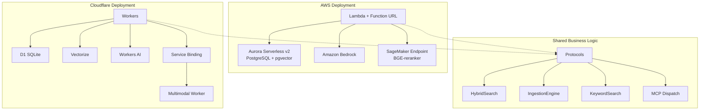

# Add AWS Infrastructure Support (Alongside Cloudflare)

## Current Architecture

The project already has clean Protocol abstractions in [`src/protocols.py`](../../src/protocols.py) that decouple business logic from Cloudflare bindings:

- `VectorStore` -- vector upsert/query/delete (Cloudflare Vectorize)
- `KeywordStore` -- BM25 keyword search, document CRUD (Cloudflare D1)
- `AIProvider` -- embeddings + reranking (Cloudflare Workers AI)
- `ImageProcessor` -- vision/OCR pipeline (Cloudflare Service Binding)
- `LicenseStore` -- license CRUD (Cloudflare D1)

All business logic (`hybrid_search.py`, `ingestion.py`, `chunking.py`, `keyword_search.py`) depends **only** on these protocols. This means adding AWS support requires zero changes to business logic -- we only need new binding implementations and a new compute entry point.

## Cloudflare to AWS Service Mapping

| Cloudflare Service | Purpose | AWS Equivalent | Notes |
|---|---|---|---|
| **Workers** (Pyodide) | HTTP compute | **Lambda + Function URL** or **ECS Fargate** | Lambda for simplicity; ECS for long-running image processing |
| **D1** (SQLite) | SQL database (documents, BM25, licenses, settings) | **Aurora Serverless v2 (PostgreSQL)** | SQL-compatible, minimal schema changes; truly serverless |
| **Vectorize** (384-dim cosine) | Vector similarity search | **pgvector on Aurora PostgreSQL** | Consolidates D1 + Vectorize into one database; supports cosine similarity on 384-dim vectors |
| **Workers AI** (BGE-small) | Embeddings (384-dim) | **Amazon Bedrock** (Titan Embeddings v2) or **SageMaker** (host BGE-small directly) | Bedrock: zero-ops, different model/dims. SageMaker: exact model match, more ops overhead |
| **Workers AI** (BGE-reranker) | Cross-encoder reranking | **SageMaker** (host BGE-reranker-base) | Bedrock has no reranker models; SageMaker required for this |
| **Workers AI** (Llama 4 Scout) | Vision / OCR | **Amazon Bedrock** (Llama 4 Scout or Claude) | Llama 4 Scout is available on Bedrock |
| **Service Binding** | Worker-to-worker call | **Lambda invoke** or **consolidate** | Can merge multimodal into same service |
| **Secrets** (`wrangler secret`) | API_KEY, INTERNAL_SECRET | **AWS Secrets Manager** or **SSM Parameter Store** | SSM is cheaper for simple key-value secrets |

## Key Decision: Embedding Model Strategy

This is the most impactful decision because it affects data portability between Cloudflare and AWS:

- **Option A: SageMaker with BGE-small-en-v1.5** -- Exact same model, same 384 dimensions, vectors are portable between Cloudflare and AWS. Higher ops overhead (endpoint management, scaling).
- **Option B: Bedrock with Titan Embeddings v2** -- Zero-ops managed service, but 1024 dimensions (configurable down to 256). Vectors are NOT portable -- AWS and Cloudflare would have separate vector indexes.

**Recommendation**: Start with **Option B (Bedrock)** for simplicity. Each deployment target (Cloudflare vs AWS) maintains its own vector index anyway. If portability becomes important, switch to SageMaker with BGE later.

## Architecture: Consolidated Aurora (pgvector)

Instead of mapping D1 to one service and Vectorize to another, consolidate both into **Aurora Serverless v2 with pgvector**:



Aurora with pgvector handles:

- All SQL tables (documents, keywords, term_stats, doc_stats, licenses, settings) -- direct migration from D1
- Vector storage and cosine similarity search via `vector(384)` column type
- Full-text search capabilities (PostgreSQL `tsvector` as an optional upgrade over manual BM25)

## Implementation Plan

### 1. AWS Binding Implementations (`src/bindings/aws/`)

Create AWS-specific implementations of each Protocol:

**`src/bindings/aws/aurora_keyword_store.py`** -- implements `KeywordStore` + `LicenseStore`:

- Uses `asyncpg` for async PostgreSQL access
- Same SQL queries as D1, adapted for PostgreSQL syntax (e.g., `datetime('now')` to `NOW()`, `INTEGER` booleans to `BOOLEAN`)
- Connection pooling via `asyncpg.Pool`

**`src/bindings/aws/aurora_vector_store.py`** -- implements `VectorStore`:

- Uses `asyncpg` + pgvector
- `upsert()` maps to `INSERT ... ON CONFLICT DO UPDATE` with `vector(384)` column
- `query()` maps to `SELECT ... ORDER BY embedding <=> $1 LIMIT $2` (cosine distance)
- `delete_by_ids()` maps to `DELETE FROM vectors WHERE id = ANY($1)`

**`src/bindings/aws/bedrock_ai_provider.py`** -- implements `AIProvider`:

- Uses `boto3` / `aioboto3` for Bedrock Runtime
- `embed()` calls Titan Embeddings v2 (or Cohere Embed)
- `rerank()` calls a SageMaker endpoint hosting BGE-reranker-base
- `embed_batch()` can use Bedrock batch if available

**`src/bindings/aws/bedrock_image_processor.py`** -- implements `ImageProcessor`:

- Uses Bedrock Runtime to invoke Llama 4 Scout (or Claude) for vision
- Consolidates vision + OCR + embedding into a single Lambda (no need for a separate service)

**`src/bindings/aws/settings_store.py`** -- implements settings via Aurora or SSM Parameter Store

### 2. New Entry Point

**`src/aws_lambda_handler.py`** -- Lambda handler that:

- Receives API Gateway / Function URL events
- Constructs AWS binding wrappers instead of Cloudflare ones
- Passes them to the same routing/dispatch logic
- Uses `mangum` or a custom handler to wrap the existing HTTP routing

Alternatively, **`src/aws_app.py`** using FastAPI:

- Standard ASGI app deployable on Lambda (via Mangum) or ECS/EKS
- Same routes as the Cloudflare Worker, same protocol wiring
- More flexible: can run locally, in Docker, on ECS, or via Lambda

### 3. Schema Migration (SQLite to PostgreSQL)

**`schema_postgres.sql`**:

- `INTEGER PRIMARY KEY AUTOINCREMENT` to `SERIAL PRIMARY KEY` or `TEXT PRIMARY KEY`
- `TEXT DEFAULT (datetime('now'))` to `TIMESTAMP WITH TIME ZONE DEFAULT NOW()`
- `INTEGER DEFAULT 0` (boolean) to `BOOLEAN DEFAULT FALSE`
- Add pgvector extension: `CREATE EXTENSION IF NOT EXISTS vector;`
- Add vectors table: `embedding vector(384)` column with IVFFlat or HNSW index

### 4. Infrastructure as Code

**`infra/aws/`** directory with Terraform:

- Aurora Serverless v2 cluster (PostgreSQL 16 + pgvector)
- Lambda function(s) with Function URL
- IAM roles (Bedrock access, Aurora access, SageMaker invoke)
- VPC + security groups (Lambda in VPC for Aurora access)
- Secrets Manager for API_KEY
- Optional: SageMaker endpoint for BGE-reranker
- Optional: API Gateway for custom domain

### 5. Configuration / Provider Selection

**`src/config.py`** -- environment-based provider factory:

```python
import os

def create_bindings(env=None):
    platform = os.environ.get("PLATFORM", "cloudflare")
    
    if platform == "aws":
        from bindings.aws.aurora_keyword_store import AuroraKeywordStore
        from bindings.aws.aurora_vector_store import AuroraVectorStore
        from bindings.aws.bedrock_ai_provider import BedrockAIProvider
        from bindings.aws.bedrock_image_processor import BedrockImageProcessor
        return {
            "vector_store": AuroraVectorStore(pool),
            "keyword_store": AuroraKeywordStore(pool),
            "ai_provider": BedrockAIProvider(region),
            "image_processor": BedrockImageProcessor(region),
            # ...
        }
    else:
        # existing Cloudflare bindings
        ...
```

### 6. Dependencies

New Python dependencies for AWS:

- `asyncpg` -- async PostgreSQL driver
- `pgvector` -- pgvector Python bindings for asyncpg
- `boto3` / `aioboto3` -- AWS SDK (Bedrock, SageMaker, Secrets Manager)
- `mangum` -- ASGI adapter for Lambda (if using FastAPI approach)
- `fastapi` + `uvicorn` -- web framework (if using FastAPI approach)

## Effort Estimate

| Task | Effort | Complexity |
|---|---|---|
| AWS binding implementations (5 files) | 2-3 days | Medium -- protocol contracts are clear |
| PostgreSQL schema migration | 0.5 day | Low -- straightforward SQL translation |
| Lambda/FastAPI entry point | 1-2 days | Medium -- HTTP routing already exists |
| Terraform infrastructure | 1-2 days | Medium -- standard AWS resources |
| Configuration / provider factory | 0.5 day | Low |
| Testing (integration + E2E) | 2-3 days | Medium-High -- needs AWS environment |
| **Total** | **7-11 days** | |

## What Does NOT Change

- All business logic: `hybrid_search.py`, `ingestion.py`, `chunking.py`, `keyword_search.py`
- MCP tool metadata and dispatch (`vectorize-mcp-tool/`)
- Models (`models.py`)
- Protocols (`protocols.py`) -- they remain the interface contract
- CLI tool (`vectorize-mcp-tool/`) -- it talks HTTP, doesn't care about backend
- Dashboard, llms.txt, auth logic (minor adaptation for auth)

## Risks and Tradeoffs

- **Cold starts**: Lambda cold starts (~1-3s) vs Workers (~0ms). Mitigated with provisioned concurrency or ECS.
- **Cost model**: Workers is flat-rate; Lambda/Aurora/Bedrock is pay-per-use. Could be cheaper or more expensive depending on traffic.
- **pgvector scale**: Works well up to ~1M vectors with HNSW index. Beyond that, consider OpenSearch Serverless.
- **Reranking**: Bedrock lacks reranker models. SageMaker endpoint adds ops overhead and cost (~$0.07/hr for ml.g5.xlarge). Could skip reranking on AWS or use a simpler scoring heuristic.
- **Image processing latency**: Lambda has a 15-minute timeout vs Workers' 30s. Llama 4 Scout on Bedrock may be slower than Workers AI.

## Task Checklist

- [ ] Create AWS binding implementations in `src/bindings/aws/` -- AuroraKeywordStore, AuroraVectorStore, BedrockAIProvider, BedrockImageProcessor, AuroraLicenseStore, AuroraSettingsStore
- [ ] Migrate schema.sql to PostgreSQL syntax with pgvector extension (`schema_postgres.sql`)
- [ ] Create AWS entry point -- Lambda handler or FastAPI app with Mangum adapter
- [ ] Add provider factory (`src/config.py`) for environment-based Cloudflare/AWS binding selection
- [ ] Create Terraform modules in `infra/aws/` for Aurora Serverless, Lambda, IAM, VPC, Secrets Manager
- [ ] Add AWS Python dependencies (asyncpg, pgvector, boto3/aioboto3, mangum, fastapi)
- [ ] Write integration tests for AWS bindings against local PostgreSQL + localstack
